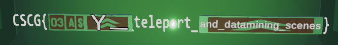

# Follow The White Rabbit - Datamining

The challenge gives us a zip file with a game.

Looking at the extracted files we can see a `UnityCrashHandler.exe` and `UnityPlayer.dll`
so clearly the game was written in Unity.

From the description, the challenge seems to be to access some unreleased content.

If we watch the [game trailer](https://www.youtube.com/watch?v=IhLBamqn_5Q) we can even
see a place in the wooden fort where a white rabbit says "Under construction... Please come back in a future update!"
and some flashes of a building in the water that isn't there in our game.

Using a tool like [uTinyRipper](https://github.com/mafaca/UtinyRipper) we can extract all the assets from the game.

Looking at the scene files in `Assets/Scene/Scenes` we can an interesting scene called `FlagLand_Update.unity`.

This seems to be what we are looking for.

Using `dnSpy` we can try to patch the `LoadYourAsyncScene` method of the `SceneLoader` to
try and load the `FlagLand_Update` scene instead of the default `FlagLand` scene:

```c#
private IEnumerator LoadYourAsyncScene() {
    int buildIndex = SceneManager.GetActiveScene().buildIndex;
    AsyncOperation asyncLoad = SceneManager.LoadSceneAsync("FlagLand");     // Change this to "FlagLand_Update"
    asyncLoad.allowSceneActivation = false;
    while (!asyncLoad.isDone) {
        this.t_progress.text = Mathf.Abs(asyncLoad.progress * 100f) + "%";
        Debug.Log("Loading progress :" + asyncLoad.progress);
        if (asyncLoad.progress >= 0.9f) {
            asyncLoad.allowSceneActivation = true;
        }
        yield return null;
    }
    asyncLoad.allowSceneActivation = true;
    yield break;
}
```

However, this doesn't work. The scene loading always stops at 90% so it looks like there is a problem loading the scene directly.

Let's have a direct look at the scene to find out what the problem is. We can just open the `FlagLand_Update.unity` file
using the `UnityEditor` and have a look at the scene.

In the editor, we can see the building that the game trailer teased for the update.
If we fly into the building we can see this:


This looks like the flag but it seems like some parts are missing.

If we check the components of the `PartialFlag2Display` we can see three text objects that aren't displayed
correctly. Two of the objects just use a `TextMeshPro` component with a fixed text.

Since Unity isn't able to find the `TextMeshPro` script it doesn't display the text but if we open
the `FlagLand_Update.unity` file in a text editor we can see that it is actually just a YAML file.

With some digging, we can find the two components and see that their `m_text` attributes are `Y` and `_`.

The third text object has a `PartialFlag2` component that sets the text at runtime.
Using `dnSpy` we can easily reverse its code:

```c#
public class PartialFlag2 : MonoBehaviour {
    private void Start() {
        this.flagProbablyHardToGetStatically();
        TextMeshPro component = base.GetComponent<TextMeshPro>();
        string text = "aof\\`drfe`dbbjQ|st|vg";
        int num = 0;
        for (int i = 0; i < text.Length; i++)
        {
            TextMeshPro textMeshPro = component;
            textMeshPro.text += ((char)((int)text[i] ^ num)).ToString();
            num++;
        }
    }

    private void flagProbablyHardToGetStatically() {
        base.GetComponent<TextMeshPro>().text = "";
    }

    private void Update() {}
}
```

We can see that the script just `xor`s each letter in ``aof\`drfe`dbbjQ|st|vg`` with its index.

Using some quick Python code we can easily decode the text:

```python
flag = ""
for i, c in enumerate(b"aof\\`drfe`dbbjQ|st|vg"):
    flag += chr(c ^ i)
print(flag)
```

This prints out `and_datamining_scenes`.

Together with the other parts, the flag seems to end with `Y_teleport_and_datamining_scenes` but there is still something missing
at the start. In Unity, we can see that there are a lot of overlapping sings at this position and it's not clear what they are
supposed to spell out.

Maybe it's easier to see if we can load the scene into the game. Looking at the scene in Unity
it is clear that it only contains the updated content and not all the rest of the level. This
explains why we weren't able to directly load the scene into Unity.

It looks like the scene is supposed to get loaded in addition to the main level.

For this purpose, it is possible to load a scene additively. This will not replace
the currently loaded scene but instead just add the content from the loaded scene to the current one.

If we look at the `UILoader` class in `dnSpy` we can see that it already contains
some code that loads some UI to show the FPS when the `F2` button is pressed and it also uses additive loading.

We can just copy that code and modify it a to load the `FlagLand_Update` scene when the `F3` button is pressed:

```c#
if (Input.GetKeyDown(KeyCode.F3)) {
    if (!SceneManager.GetSceneByName("FlagLand_Update").isLoaded) {
        SceneManager.LoadSceneAsync("FlagLand_Update", LoadSceneMode.Additive);
    } else {
        SceneManager.UnloadSceneAsync("FlagLand_Update");
    }
}
```

If we run the game we can now press `F3` and the building appears in the game.

However, there is still one problem left: We can't get to the building since it's so high up
and we also can't get inside since it is completely locked in.

The `teleport` in the partial flag already hints at a solution to this:
We can simply add some code that allows us to teleport however we want.

I just modified the end of the `Update` function of the `PlayerController` to this:

```c#
if (Input.GetKeyDown(KeyCode.F4)) {
    base.transform.position += base.transform.forward * 2f;
    return;
}
if (Input.GetKeyDown(KeyCode.F5)) {
    base.transform.position += base.transform.up * 5f;
    return;
}
this.m_CharCtrl.Move(vector);
this.m_IsGrounded = this.m_CharCtrl.isGrounded;
```

This allows us to teleport forwards using `F4` and upwards using `F5`.
We also return if one of those was pressed to block the normal movement.

With this, we can now start the game, press `F3` to load the unreleased content,
walk under the building, press `F5` a few times to get onto it and press `F4`
to teleport in.

Inside, we can now read the flag:



`CSCG{03ASY_teleport_and_datamining_scenes}`
